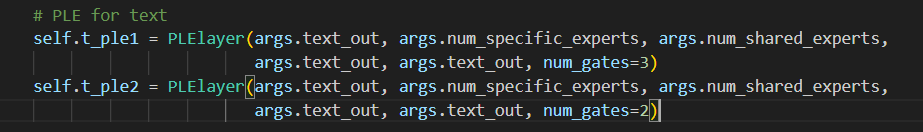
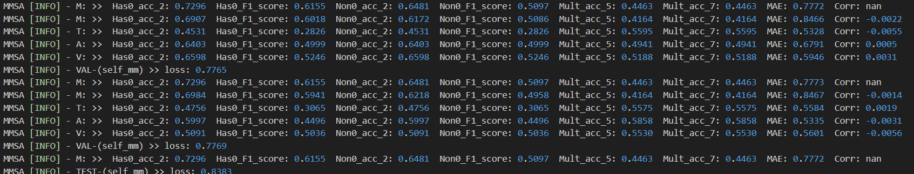
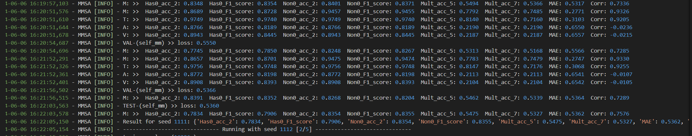
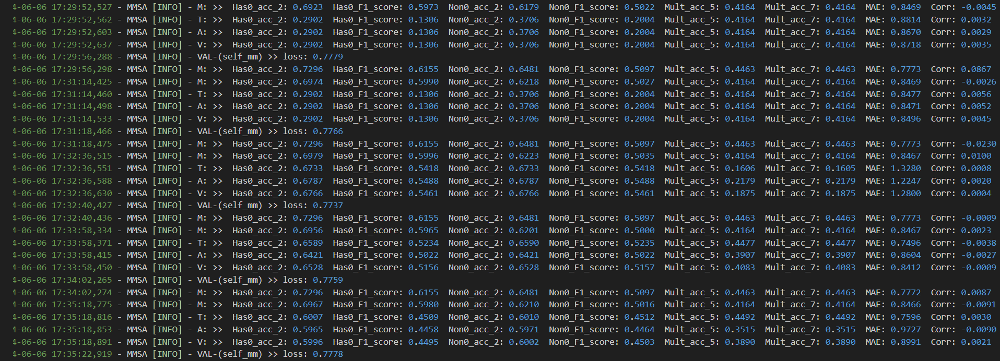

# 数据

使用的是MMSA（https://github.com/thuiar/MMSA）中处理好的特征。
数据链接：https://pan.baidu.com/s/10mzWQfVUsFhWP5j6oU9AuQ?pwd=1234 
提取码：1234 
---
处理数据（添加emotion标签）脚本在data_preprocessing文件夹中
数据链接：https://pan.baidu.com/s/1DIeBQ7xIC1bpbnwyTHwpLA?pwd=1234 
提取码：1234 

问题1：MMSA代码库中提供的数据标签并不是按照CMU-SDK中切片的顺序，clip-id的值应该是重新切片的，所以在标签对应上需要解决。
处理的代码在data_preprocessing/create_mosei_label.py
按照clip—id的大小顺序和SDK原始文件的时间切片序列interval值的大小顺序对应，进行赋值的。

# 模型代码

1、添加/models/subNets/PLE.py代码
PLElayer通过控制num_gates参数可以实现两个门控输出或者三个门控输出（低层特征提取）

2、修改self_mm模型代码，位于/models/multiTask/SELF_MM.py

每个模态由两层PLE层组成，第一层输出3个门控值，第二层输出2个任务相关值。

3、修改self_mm训练代码，位于/trains/multiTask/SELF_MM.py
修改比较少，只是在原来loss上加了一个L1loss

问题：
模型的输出没有检查出问题，但是训练的指数corr为负的？

去掉ple后，可以正常训练

加上ple后，训练不通
