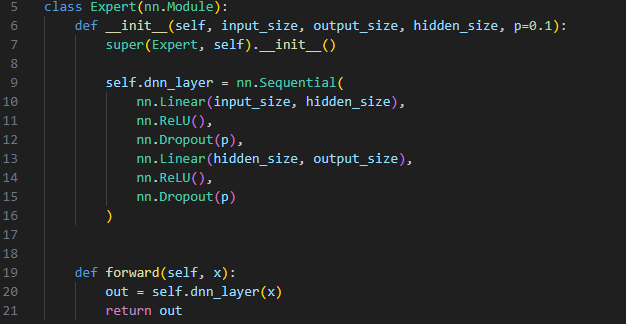

# 数据

数据标注在CSV文件中
---

使用的是MMSA（https://github.com/thuiar/MMSA）中处理好的特征。
数据链接：https://pan.baidu.com/s/10mzWQfVUsFhWP5j6oU9AuQ?pwd=1234 
提取码：1234 

处理数据（添加emotion标签）脚本在data_preprocessing文件夹中
数据链接：https://pan.baidu.com/s/1DIeBQ7xIC1bpbnwyTHwpLA?pwd=1234 
提取码：1234 

问题1：MMSA代码库中提供的数据标签并不是按照CMU-SDK中切片的顺序，clip-id的值应该是重新切片的，所以在标签对应上需要解决。
处理的代码在data_preprocessing/create_mosei_label.py
按照clip—id的大小顺序和SDK原始文件的时间切片序列interval值的大小顺序对应，进行赋值的。


# 模型代码

1、添加/models/subNets/PLE.py代码
PLElayer通过控制num_gates参数可以实现两个门控输出或者三个门控输出（低层特征提取）

2、修改self_mm模型代码，位于/models/multiTask/SELF_MM.py

每个模态由两层PLE层组成，第一层输出3个门控值，第二层输出2个任务相关值。

3、修改self_mm训练代码，位于/trains/multiTask/SELF_MM.py
修改比较少，只是在原来loss上加了一个L1loss


问题：
模型的输出没有检查出问题，但是训练的指数corr为负的？


2024/6/6
---
去掉ple后，可以正常训练

加上ple后，训练不通

加上ple，去掉selfmm的单模损失，还是训不通


2024/6/8
---
重新修改了代码，包括完善了expert模型，以self—mm模型为基础，去掉self-mm中的单模态的辅助任务。

ple: 任务1 任务2 共享层均1个专家的设置下，同样训不通，corr为nan

训练损失设置为1：5，不成功

是不是数据的问题？

# 使用说明

1、在self-mm代码中每个模态特征提取之后，添加了ple模块 （位于/models/multiTask/SELF_MM.py）


2、ple的实现过程展示在/models/subNets/PLE.py中，其中包括了每个专家的模型结构


以及两种ple的实现，一种是有3个gate的网络结构，一种是只包含cgc的结构。


3、情绪识别任务的设置情况，我设置了一个四分类的分类任务，在data_loader里做了以下映射
```
# 我统计了一下标签情况
# [0.0, 0.16666667, 0.33333334, 0.5, 0.6666667, 0.8333333, 1.0, 
#  1.1666666, 1.3333334, 1.5, 1.6666666, 2.0, 
#  2.1666667, 2.3333333, 2.6666667, 3.0]
然后按照0.0为0，（>0.0 & <=1.0）为1 （>1.0 & <=2.0）为2 （>2.0 & <= 3.0）为3进行了映射
```

情绪识别部分的专属网络结构的代码

4、两部分的损失计算
